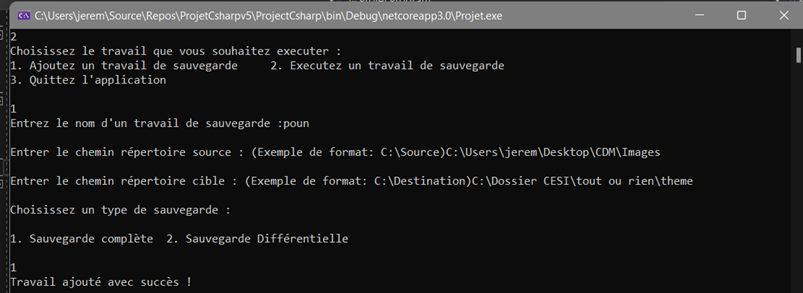

# EasySave

## User Guide

### V1  Console App

The user will be guided through the EasySave experience. Follow the instruction displayed on the console and answer with numbers on your keyboard

#### Add a backup work :

To create a backup work, enter 1:
then the program will ask you severals informations :
  1. a name to identify your Save
  2. a source directory, where the program will copy the files from
  3. a target directory, where the program will paste the file in
  4. a type of save, complete ou differencial

